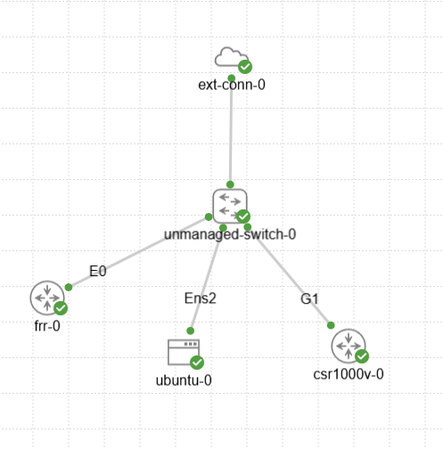

# virl2-clientを使ってラボを作成する

ノード数が多いラボを作るときには、手作業で作成するよりもPythonで作成した方が圧倒的に簡単です。

<br><br>

## 環境構築

Pythonを使いますので環境を整えます。

```bash
python3 -m venv .venv
direnv allow
pip install --upgrade pip
pip install -r requirements.txt
```

<br>

> [!NOTE]
>
> Pythonのモジュール virl2_client はCMLのバージョンと一致させる必要があります。requirements.txtに記載のバージョンを確認してください。

<br>

`bin/cml_config.py` にCMLの環境情報を設定します。

```python
# CMLのIPアドレス
CML_ADDRESS = "192.168.122.212"

# CMLのユーザ名
CML_USERNAME = "admin"

# CMLのパスワード
CML_PASSWORD = "Cisco123"
```

アカウント情報は `.env` に環境変数として記述した方が安全ですが、ここでは簡単のためこのようにしています。

<br>

> [!NOTE]
>
> マニュアルから引用。
>
> If no username or password are given then the environment will be checked,
> looking for VIRL2_USER or VIRL_USERNAME and VIRL2_PASS or VIRL_PASSWORD, espectively.
> Environment variables take precedence over those provided in arguments.
>
> It’s also possible to pass the URL as an environment variable VIRL2_URL or VIRL_HOST.

<br>

## 事前準備

Pythonスクリプトで作成するにあたって、手作業で簡単なラボを作って、必要な情報を確認します。

必要になるノードを適当に散りばめてラボを作成します。どうせすぐに消すのでラボの名前は何でも構いません。

このときノードの設定で `Image Definition` は `Automatic` ではなく手作業で選択します。

<br>



<br>

上部のメニューから　`LAB`　→　`Download Lab`　を辿ってラボの情報をYAMLでダウンロードします。

抜粋すると、こんな感じです。

`node_definition`　および　`image_definition`　が重要なパラメータで、これらでノードの種類と起動するイメージを識別しています。

```YAML
nodes:
  -
    label: frr-0
    image_definition: frr-10-2-1-r1
    node_definition: frr
    x: -224
    y: -147

  -
    label: ubuntu-0
    image_definition: ubuntu-24-04-20250503
    node_definition: ubuntu
    tags: []
    x: -71
    y: -86

  -
    label: csr1000v-0
    image_definition: csr1000v-17-03-08a
    node_definition: csr1000v
    tags: []
    x: 114
    y: -93

  -
    label: unmanaged-switch-0
    node_definition: unmanaged_switch
    x: -19
    y: -250

  -
    label: ext-conn-0
    node_definition: external_connector
    x: -17
    y: -418
```

Ubuntuを作りたければ、node_definitionは `ubuntu` を、image_definitionは `ubuntu-24-04-20250503` を指定すればよいことになります。

それさえ分かれば、このラボおよびダウンロードしたYAMLは破棄して構いません。

<br>

## ubuntuを含むラボを作ってみる

`bin/cml_create_lab1.py` を使います。

削除するには `-d` を引数に与えます。

<br>

> [!NOTE]
>
> 実行時に表示される
>
> `SSL Verification disabled`
>
> というメッセージを消すには証明書の検証を有効にするしかありません。
> virl2_clientのソースコード virl2_client.py をみればわかります。

<br>

## frr(Docker)を含むラボを作ってみる

`bin/cml_create_lab2.py`

CML2.9からサポートされたDockerのイメージも同じように作れます。

DockerイメージでFRRを動かす場合、設定が複数ありますので、設定ファイルの名前とその中身を辞書型にして渡してあげる必要があります。
