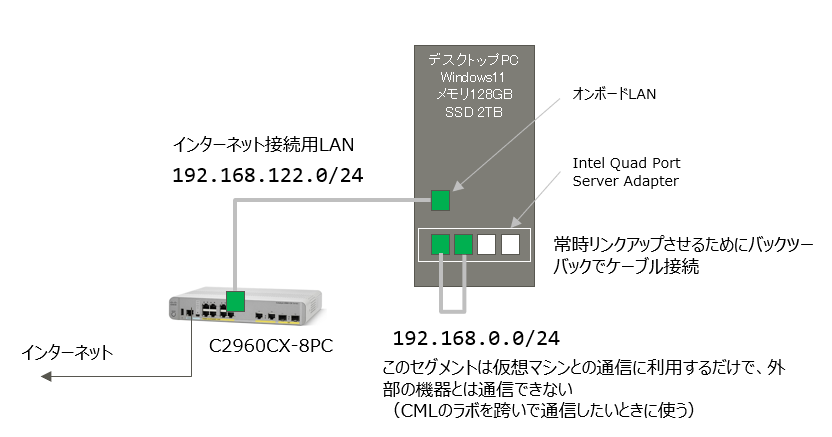
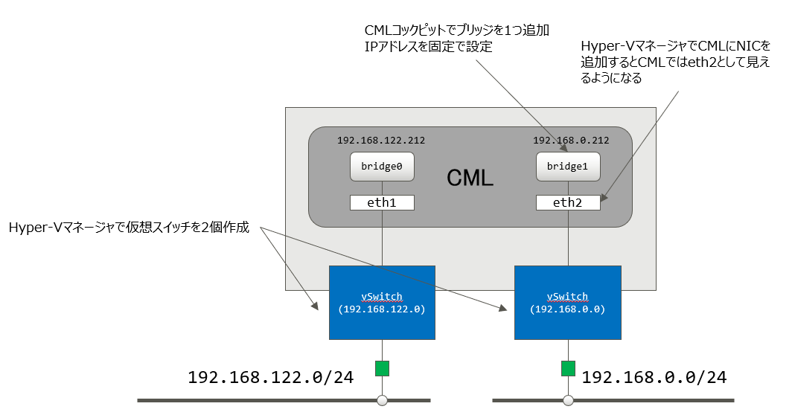
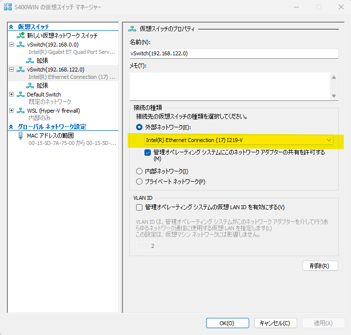
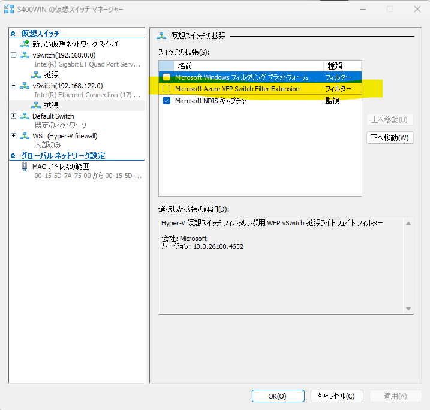
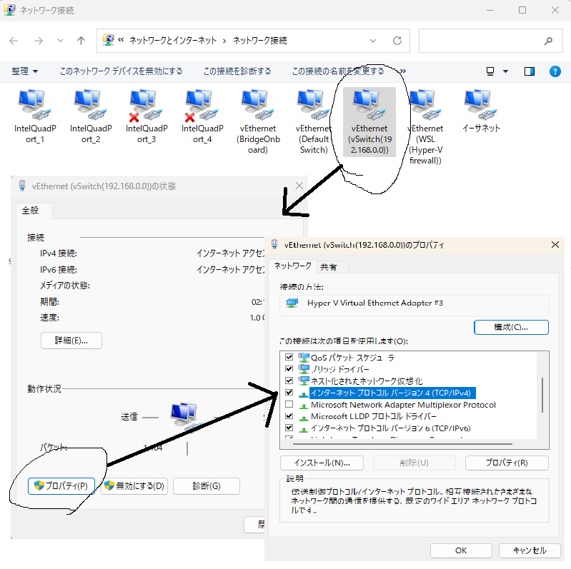
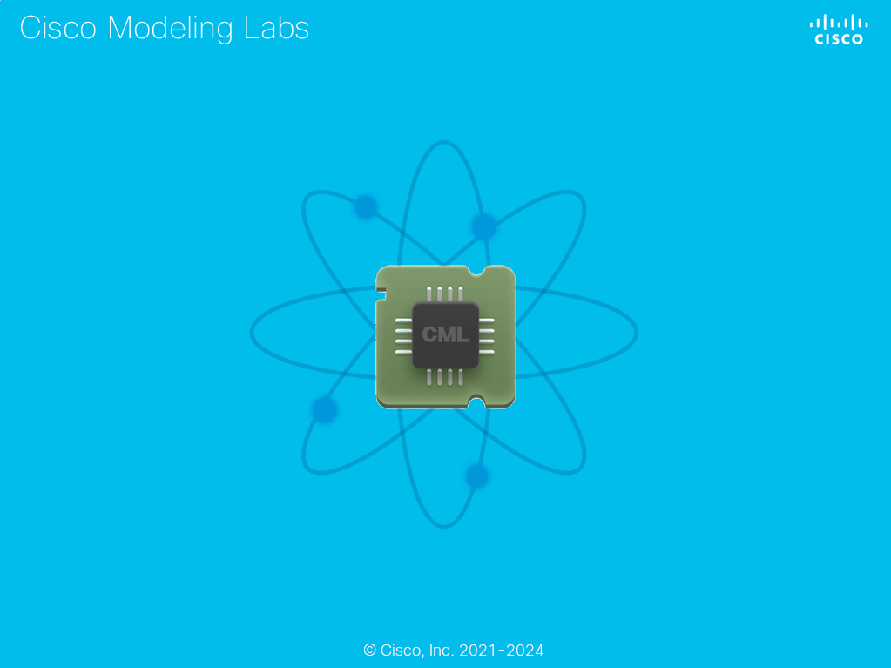
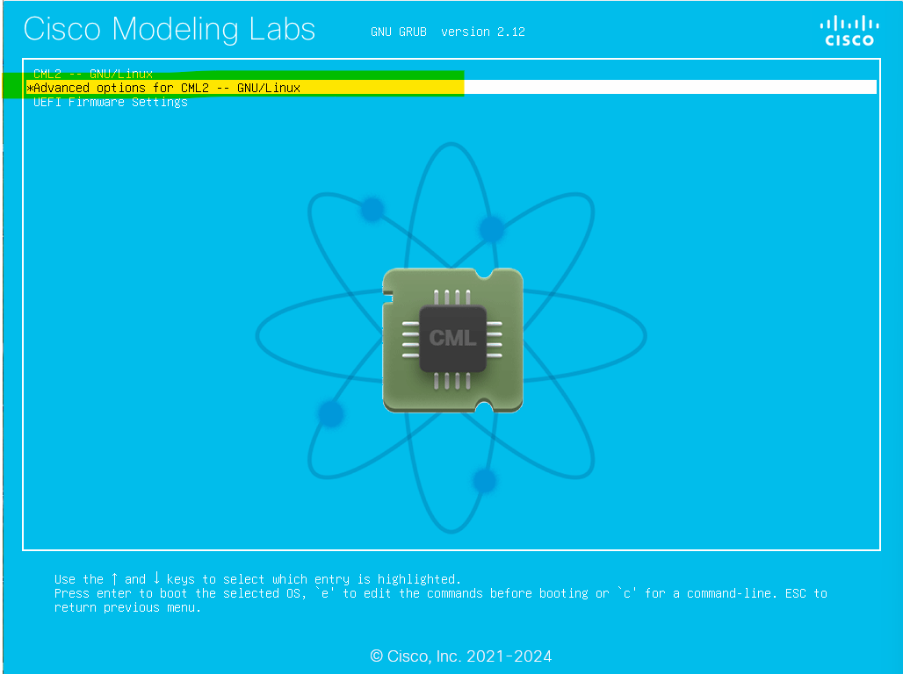

# CMLメモ

CMLについての個人的メモです。

新しいバージョンが出るたびに新規で作り直していますので、作業手順を忘れないようにメモを残します。

<br><br>

## CMLについて

毎年年末になるとCMLのライセンスがセールになるので、その機を逃さずに購入します。

<br><br>

## インストール

以下のマシンを母艦として利用します。

|項目|値|
|---|---|
| プロセッサ      | 12th Gen Intel Core i7-12700 (2.10GHz) |
| 実装RAM         | 128 GB                                 |
| ストレージ      | 2.77 TB                                 |
| OS             | Windows 11 Pro                          |

Hyper-Vが必要になりますので、Windowsの条件はPro以上になります。

母艦となるWindowsではIISを有効にしておきます。
CML上の仮想マシンにファイルを受け渡すのに使います。

<br>

### CML環境

Hyper-Vを有効にしたWindows11上でCMLを動かします。

このWindows11には物理NICが5個あり、そのうち2個を利用しています（常時リンクアップさせるためのポートを含めると合計3ポート使用）。

2個のNICのうち一つは実際にインターネットに出ていけるLAN、もう一つはリンクアップしているだけの何もつながっていないNICです。

<br>



<br>

CMLを二本足のマシンにして、それぞれブリッジで繋ぎます。★ここ重要

CML内のラボ機器にインターネットに出ていける外部のアドレスを割り当てたいときには `bridge0` につなぎます。

外部接続は不要なものの、母艦となるWindowsとは通信したい、という場合には `bridge1` につなぎます。

CML内の異なるラボの機器同士で通信したい、という場合も `bridge1` を経由すると便利です。



<br>

#### CMLのアドレスとアクセス方法

|項目|値|
|---|---|
| IPアドレス      | 192.168.122.212/24 |

CMLへのアクセス方法

- SSH接続 ssh://192.168.122.212:1122
- ダッシュボード https://192.168.122.212
- コックピット https://192.168.122.212:9090

<br>

### インストール

Hyper-Vの仮想スイッチマネージャで仮想スイッチを２個作成します。

１つ目は名前を `vSwitch(192.168.122.0)` としておきます。

接続種類は外部ネットワーク、インターネットに出ていけるNICを選択します。



<br>

`拡張`　のメニューで「Microsoft Azure VFP Switch Filter Extension」が有効になっているので、これを外しておきます。



２つ目は名前を `vSwitch(192.168.0.0)` としておきます。

接続種類は外部ネットワーク、インターネットには繋がっていないNICを選択します。

`拡張`　のメニューで「Microsoft Azure VFP Switch Filter Extension」が有効になっているので、これを外しておきます。

母艦となっているWindows11にIPアドレス 192.168.0.198/24 を割り当てます。

`コントロールパネル`　→　`ネットワークと共有センター`　→　`アダプターの設定の変更`　を開くと `vEthernet(vSwitch(192.168.0.0))` というアダプタが見えるので、そのIPアドレスを固定で設定します。

<br>



<br><br>

以下の条件でHyper-V上に仮想マシンを作成、設定を行います。

起動する前にやるべきことがあるので、まだ起動はしません。

- 名前 CML2.9 を指定（なんでもよい）
- メモリ 98304MB に変更
- 仮想ハードディスク 256GB に変更
- 動的メモリは外す
- 仮想プロセッサの数 16 に変更
- セキュリティ
    - セキュアブートを有効にする のチェックを外す
- ネットワークアダプター
    - 仮想スイッチ vSwitch(192.168.122.0) に接続する
    - 高度な機能 MACアドレスのスプーフィングを有効にする をチェックする

ネットワークアダプタは後ほどもう一つ追加します。この時点ではインターネットに出れるネットワークアダプタを一つ接続しておきます。

<br>

> [!NOTE]
>
> ハードディスクイメージの場所は仮想マシン作成時に指定できますが、既定では以下の場所になります。
>
> C:\ProgramData\Microsoft\Windows\Virtual Hard Disks
>
> 仮想マシンを削除してもハードディスクイメージが残りますので、この場所をチェックして使っていないディスクイメージがあれば手動で削除します。

<br>

仮想マシンを作成したら **管理者としてPowerShellを起動して** 以下を実行します。

```bash
Set-VMProcessor -VMName {{仮想マシンの名前}} -ExposeVirtualizationExtensions $true
```

仮想マシンの名前はHyper-V作成時に指定したものです。
たとえば、こうなります。

```bash
Set-VMProcessor -VMName CML2.9 -ExposeVirtualizationExtensions $true
```

仮想マシンのDVDドライブにCMLのベアインストール用のISOイメージファイルを指定して起動します。

しばらく黒い背景の画面が続き、再起動がかかります。このとき画面から目を離さないようにします。

うっかり離席したりすると、再起動がかかって、この青い画面（↓）に切り替わってしまいます。



こうなると失敗なので仮想イメージを再起動します。

選択画面で上から二番目の `Advanced options for CMLS -- GNU/Linux` を選びます。



続いて上から二番目の `(recovery mode)` を選びます。

続いて `Control-D` を押下します。これでCMLの初期設定が始まります。

途中でreference platform imageのDVDを入れろ、と言われるのでHyper-Vのメディアメニューでisoイメージを指定します。

オプションサービスの有効化を問われるので、OpenSSHとPATtyを有効にしておきます。これは後から変更できるので任意です。

管理者アカウントのデフォルトはsysadminになっていますが、紛らわしくなるのが嫌なので、CMLユーザと同じ `admin` にしておきます。

これでCMLのインストールは完了ですが、快適に使うにはもう少々、設定が必要です。

<br>

### PATtyの設定

PATtyを有効にするとCML上の仮想マシンのシリアルコンソールとTCPポート番号を対応付けてくれます。

コックピットに入ります。

https://192.168.122.212:9090


以下の手順１～３を実施します。

- 手順１．コックピットの「サービス」からvirl2-pattyを探してONにする

インストール中にPATtyを有効にしていればこの作業は不要です。

- 手順２．/etc/default/patty.envのファイルにある OPTS="-vnc -serial" のコメントを外す

コックピットの左下「端末」をクリックするとターミナルが開きます。

```bash
sudo vi /etc/default/patty.env
```

- 手順３．コックピットの「サービス」からfirewalldを探してOFFにする、もしくはネットワーキングを選択してファイアウォールを無効にする

CMLへの着信通信を許可してもよいのですが、面倒なのでファイアウォールを停止します。

<br><br>

CMLで作成する仮想マシンのタグに `serial:5000` や `vnc:7000` などを設定すると、仮想マシンに外部から直接接続できるようになります。

<br>

### 起動時のスプラッシュ画面を抑止

このままではHyper-VでCMLを起動したときにスプラッシュ画面が表示されて起動しなくなってしまいます。

起動時に青い画面で

```bash
*CML2 -- GNU/Linux
```

が表示されているときに e キーを叩きます。

`linux /boot/vmlinz- ... ` の行にある splash を削除してから Ctrl-x キーを叩くとCMLが起動します。

ログインして `/etc/default/grub` を編集します。

```bash
sudo vi /etc/default/grub
```

`GRUB_CMDLINE_LINUX="splash quiet mitigations=off"` となっている行の `splash` を削除します。

```bash
sudo update-grub
```

これでスプラッシュ画面は表示されなくなります。

<br>

### ブリッジを追加

CMLを停止します。

Hyper-Vの設定でCMLの設定を変更します。

ハードウェアの追加で「ネットワークアダプター」を追加します。

仮想スイッチ　vSwitch(192.168.0.0)　に接続します。

高度な機能の中にある「MACアドレスのスプーフィングを有効にする」をチェックします。

CMLを起動します。

コックピットを開いて、左メニューから「ネットワーキング」を選択します。

インタフェースの中にある　「ブリッジの追加」　をクリックします。

名前は　`bridge1`　のままで構いません。

ポートは　`eth1`　を選びます。

ブリッジを追加したら　bridge1　を選択してIPv4アドレスを　192.168.0.212/24　に設定します。

ゲートウェイやDNSは設定しなくて構いません。

コックピットの「端末」から母艦となっているWindowsにpingが飛ぶか確認します。

```bash
ping 192.168.0.198
```


<br><br><br>

## CML追加設定（オプション）

個人的な好みで設定を変更します。

<br>

### AppArmorの停止

コックピットのサービスを開いて一番上にあるapparmorを停止します。

<br>

### タイムゾーンを変更する

初期状態ではこのように（↓）UTCになっています。

```bash
admin@cml-controller:~$ timedatectl
               Local time: Tue 2025-08-19 03:02:23 UTC
           Universal time: Tue 2025-08-19 03:02:23 UTC
                 RTC time: Tue 2025-08-19 03:02:23
                Time zone: Etc/UTC (UTC, +0000)
System clock synchronized: yes
              NTP service: active
          RTC in local TZ: no
```

タイムゾーンを変更します。

コックピットのターミナルを開いて以下を設定します。

```bash
sudo timedatectl set-timezone Asia/Tokyo
```

<br>

### 追加パッケージ

```bash
sudo apt install -y \
  binutils \
  unzip \
  zip
```


<br><br><br>

## コックピットのターミナル


- コックピットのターミナルでroot特権を取る

```bash
sudo -s -E
```

- サービスを再起動する

```bash
systemctl restart virl2.target
```

- ノード定義ファイルの場所に移動する

```bash
cd /var/lib/libvirt/images/node-definitions
```

- イメージ定義が保存されている場所に移動する

```bash
cd /var/lib/libvirt/images/virl-base-images
```

- 実体化したイメージのディレクトリに移動する

```bash
/var/local/virl2/images/
```


<br><br><br>

## 参考文献

<br>

[備忘録: Cisco CMLをHyper-Vで動かす](https://qiita.com/recuraki/items/3f5d792f2fc704052fd8)

CML2.8あたりからHyper-V上でCMLを動かすのは簡単になりました。このページに記載の多くはやらなくても大丈夫です。

<br>

[Hyper-V上でCisco CML 2.8 FreeTierがgrubから進まないを解決する](https://qiita.com/recuraki/items/50e7a34edda30d4fe92e)

CML2.8、CML2.9ではこの記事が有効です。スプラッシュ画面を消しましょう。

<br>

[CML2.6で快適な検証ライフを手に入れよう！](https://qiita.com/hiokazak/items/2c1c975132d8689b0b02)

PATtyの使い方はこのページが参考になります。firewalldの停止について記載されてませんが、実際には必要です。

<br>

[The Cisco Learning Network](https://learningnetwork.cisco.com/s/)

CMLってどこからダウンロードするんだっけ？　ライセンスはなんだっけ？　となりがち。
まずはここにアクセスして　`Store`　に飛んでからログインすればよい。
